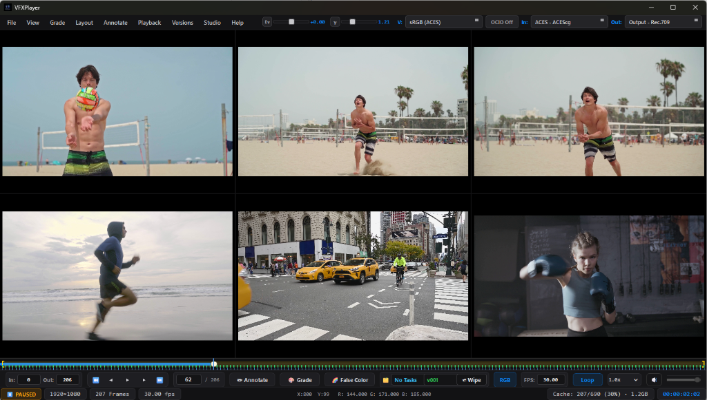
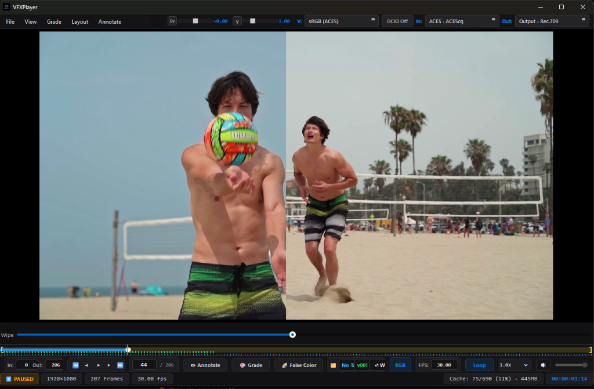
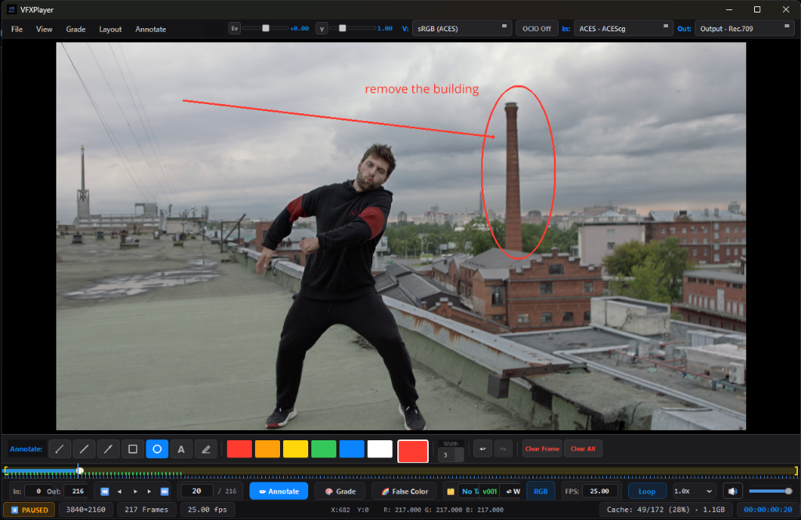
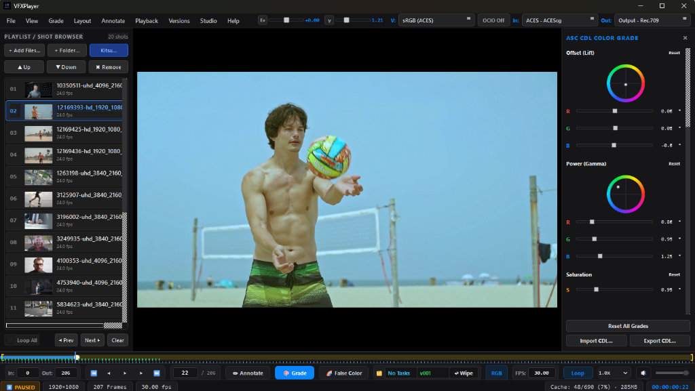
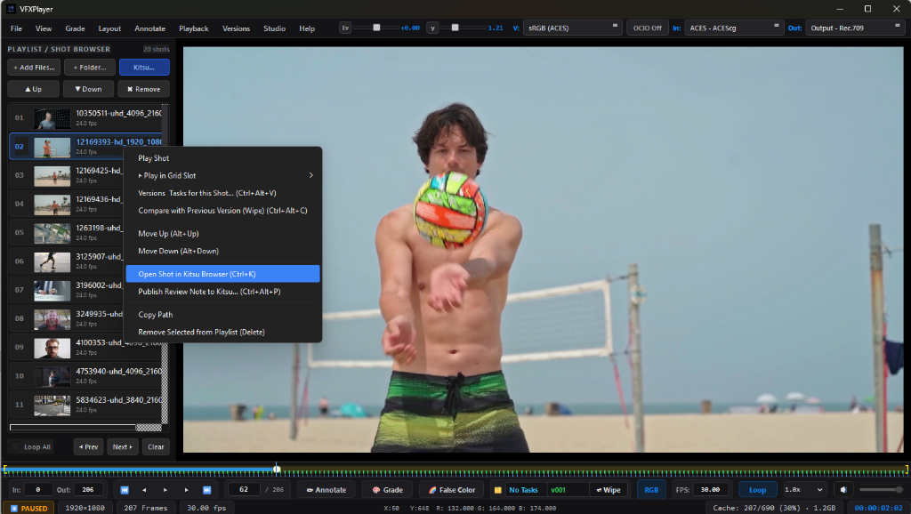

# VFX Review Player

<p align="center">
  
</p>

<p align="center">
  <strong>Professional VFX Review, Playback, Color Grading & Media Delivery Platform</strong><br>
  <em>Engineered for Visual Effects Studios, Feature Films, Commercials, and Episodic Pipelines</em>
</p>

<p align="center">
  <a href="https://github.com/azhagurajpandians/vfx-player/releases"></a>
  <a href="LICENSE"></a>
  
  
  
  
</p>

---

## 1. Overview & Visual Showcase

**VFX Review Player** is an advanced, GPU-accelerated desktop platform built from the ground up to replace fragmented dailies and playback utilities. It unites high-dynamic-range EXR image sequence inspection, professional video decoding, ACES / OpenColorIO color management, real-time ASC CDL 3-way color grading, synchronized multi-shot grid comparison, production tracking via Kitsu, and automated slate/burn-in delivery rendering into a single, cohesive application.

### Synchronized Multi-Shot Grid Review (2x3 / 6-Up Mode)
Synchronize up to 6 shots simultaneously with master transport control, independent slot assignment, and zero-drop frame scrubbing for sequence dailies and lighting continuity review.



---

### Interactive Wipe & Split Comparison
Frame-locked A/B review featuring a real-time draggable split-wipe line, dedicated wipe slider control, and seamless version-to-version inspection between comp revisions and live-action plates.



---

### Vector Annotations & Supervisor Markup
Production drawing tools featuring vector pens, directional arrows, callout ellipses, bounding boxes, text overlays, stroke width controls, and customizable color swatches. Annotations persist across timeline frames and auto-save to `.review.json` sidecars.



---

### Interactive 3-Way ASC CDL Color Grading
Interactive Lift (Offset) and Gamma (Power) color balance wheels, Slope (Gain), and Saturation sliders accelerated by a zero-latency GPU GLSL shader pipeline. Supports import and export of industry-standard `.cdl` / `.cc` XML files.



---

### Playlist, Shot Browser & Kitsu Studio Workflow
Integrated drawer with background prefetching for gapless playback, version family detection (`v001` &rarr; `v002`), side-by-side wipe comparison, and direct Kitsu/Zou production tracking integration for publishing supervisor review notes and annotated frames.



---

## 2. Architecture & Pipeline

The playback engine, GPU viewer, and media delivery pipeline share an authoritative timeline and color management architecture:

```text
                           VFX REVIEW PLAYER
                                   │
         ┌─────────────────────────┼─────────────────────────┐
         │                         │                         │
         ▼                         ▼                         ▼
    MEDIA ENGINE             REVIEW ENGINE            DELIVERY ENGINE
         │                         │                         │
   EXR / DPX / TIFF         A/B / Wipe / Splits       Configurable Slates
   ProRes / DNxHR           Multi-Shot 6-Up Grid      Burn-in Overlays
   H.264 / H.265 (HEVC)     3-Way ASC CDL Wheels      Client & Dailies Presets
   Authoritative Timecode   False Color & Scopes      ProRes / DNxHR / MP4 / MOV
   RAM / GPU Smart Cache    Kitsu Sync & Versioning   Annotation Exports
```

### Deterministic Data Flow
```text
Source File / Image Sequence
    ↓
Authoritative Timeline (Frame Number ↔ PTS ↔ SMPTE Timecode ↔ Drop-Frame)
    ↓
Multi-Tier RAM / GPU Smart Cache
    ↓
OpenColorIO / ACES Color Pipeline + ASC CDL (Slope, Offset, Power, Saturation)
    ↓
VisPy GPU Accelerated Canvas (Zero-copy OpenGL display)
    ↓
Delivery Engine (Slate frames + Dynamic Burn-in metadata)
    ↓
Deterministic Multi-Format Exporter (FFmpeg & PyAV)
```

---

## 3. Key Capabilities

### 🎬 Playback & Image Sequence Engine
- **High-Dynamic Range EXR & Sequences**: Multi-part and multi-channel `.exr`, `.sxr`, `.dpx`, `.cin`, `.tif`, `.tiff`, `.png`, `.jpg`, `.tga`, and `.webp` powered by OpenImageIO and OpenCV.
- **Professional Video Codecs**: Hardware-accelerated decoding of Apple ProRes (422, 422 HQ, 4444, 4444 XQ), Avid DNxHR, H.264, and H.265 (HEVC) containers (`.mov`, `.mp4`, `.mkv`, `.mxf`).
- **Deterministic Timebase**: Exact frame indexing, fractional framerate precision (23.976, 24.0, 25.0, 29.97, 59.94 fps), SMPTE timecode (DF/NDF), and zero-drift A/V synchronization.
- **Sequence Validation**: Automated missing-frame gap detection, corrupt frame notification, and timeline gap indicators.
- **Gapless Playlist Playback**: Multithreaded `QThreadPool` pre-buffers adjacent shots to ensure seamless timeline cuts without shot-boundary buffering freezes.

### 🎨 Color Science & Grading Tools
- **ACES & OpenColorIO (OCIO v2)**: Complete input colorspace, view transform, and display pipeline supporting ACEScg, ACEScc, Rec.709, sRGB, DCI-P3, and custom studio `.ocio` configurations.
- **Interactive 3-Way ASC CDL Wheels**: Precision chromatic wheels for Offset (Lift) and Power (Gamma), plus Slope (Gain) and Saturation sliders with `Shift`-fine control, double-click reset, and XML import/export.
- **10-Zone False Color Heatmap**: Real-time exposure evaluation (crushed blacks, 18% middle gray, skin tones, near-clip, and clipped highlights).
- **Video Scopes**: Live Waveform, RGB Parade, Vectorscope, and Histogram inspection dialogs.
- **Channel Isolation**: Instant soloing of Red, Green, Blue, Alpha, and Alpha Overlays (Checkerboard, Solid Black, Solid White).

### 🔍 Review, Comparison & Studio Tracking
- **Multi-Viewport Tile Grids**: 1-up, 2-up (side-by-side), 4-up (2x2), and 6-up (2x3) grid modes with synchronized playback and slot assignment.
- **Comparison Modes**: Real-time interactive Wipe with draggable split-line, Side-by-Side split, Difference QC mode, and Version comparison.
- **Automated Version Navigation**: Scans folders for version tokens (`v001`, `v002`, `v003`) with keyboard shortcuts (`Alt+Up`, `Alt+Down`, `Alt+Home`) and 1-click comparison against previous iterations.
- **Kitsu / Zou Production Management**:
  - Secure credential caching and review playlist synchronization.
  - Jump directly to the current shot in the Kitsu web interface (`Ctrl+K`).
  - Publish review comments, status updates (*Approved*, *Retake*, *WIP*), and annotated frame snapshots (`Ctrl+Alt+P`).
  - Compare department task versions and revisions (`Ctrl+Alt+V`).
- **Persistent Annotations**: Vector pen, shapes, text, arrows, color picker, multi-frame undo/redo, auto-saving to `.review.json` sidecars, and batch export of annotated frames (`Ctrl+Shift+E`).

### 📦 Delivery, Slates & Burn-ins
- **Production Slate Builder**: Automated slate frame generation with metadata (Show, Sequence, Shot, Version, Artist, Date, Colorspace, Resolution, FPS, Status, and Studio Logo).
- **Dynamic Burn-in Overlays**: Configurable overlays including Timecode, Frame Number, Shot Name, Version, Colorspace, Artist, and Custom Text with customizable position, font size, and background opacity.
- **Deterministic Multi-Format Delivery**: Single-pass and batch export to MP4 and MOV using H.264, H.265/HEVC, ProRes, or DNxHR presets.

---

## 4. Keyboard Shortcuts Reference

| Category | Shortcut | Action |
|---|---|---|
| **Playback** | `Space` | Play / Pause |
| | `Left` / `Right` | Step 1 Frame Backward / Forward |
| | `Shift+Left` / `Shift+Right` | Step 10 Frames Backward / Forward |
| | `Home` / `End` | Go to First / Last Frame |
| | `I` / `O` | Set In Point / Set Out Point |
| | `L` | Toggle Loop Mode |
| **Playlist & Browser** | `Page Up` / `Page Down` | Previous / Next Shot in Playlist |
| | `Ctrl+L` | Toggle Playlist / Shot Browser Drawer |
| **Layout & Comparison** | `F` | Fit Image to Viewport |
| | `F11` | Toggle Borderless Fullscreen |
| | `1` / `2` | Minimal Cinema Mode / Normal UI Mode |
| | `S` | Toggle Side-by-Side Comparison |
| | `W` | Toggle Interactive Wipe Comparison |
| **Color & Scopes** | `Ctrl+G` | Toggle 3-Way ASC CDL Grading Wheels Panel |
| | `Ctrl+Alt+F` | Toggle 10-Zone False Color Heatmap |
| | `Ctrl+Shift+S` | Open Live Video Scopes (Waveform / Parade / Vectorscope) |
| | `R` / `G` / `B` / `A` | Solo Red, Green, Blue, or Alpha Channel |
| **Annotations** | `N` or `Shift+A` | Toggle Annotation Drawing Mode |
| | `Ctrl+Z` / `Ctrl+Shift+Z` | Undo / Redo Annotation Stroke |
| | `Ctrl+Shift+E` | Batch Export All Annotated Frames |
| **Studio & Kitsu** | `Ctrl+K` | Open Current Shot in Kitsu Web Browser |
| | `Ctrl+Alt+P` | Publish Review Note & Annotated Frame to Kitsu |
| | `Ctrl+Alt+V` | Open Shot Versions & Task Compare Dialog |
| | `Alt+Up` / `Alt+Down` | Switch to Next / Previous Local Detected Version |
| | `Alt+Home` | Switch to Latest Local Version |

---

## 5. Installation & Deployment

### Windows Standalone Installer
The quickest way to install VFX Review Player on Windows 10/11 is using the self-contained installer:
1. Download `VFX_Review_Player_Setup_v1.1.3.exe` from the [Releases](https://github.com/azhagurajpandians/vfx-player/releases) page or build it locally.
2. Run the installer. It configures:
   - Non-admin user installation into `%LOCALAPPDATA%\VFX Review Player`
   - File Explorer right-click integration (**"Open with VFX Review Player"**)
   - File associations for VFX formats (`.exr`, `.dpx`, `.cin`, `.mov`, `.mp4`)
   - Desktop and Start Menu shortcuts

### Running from Source

#### Prerequisites
- Windows 10 / 11 (64-bit)
- Python 3.10 or 3.11
- Dedicated GPU with OpenGL 3.3+ support (NVIDIA, AMD, Intel Arc)
- FFmpeg and FFprobe binaries

#### Setup Steps
```powershell
# 1. Clone the repository
git clone https://github.com/azhagurajpandians/vfx-player.git
cd vfx-player

# 2. Create and activate a virtual environment
python -m venv venv
.\venv\Scripts\activate

# 3. Install Python dependencies
pip install -r requirements.txt

# 4. Launch VFX Review Player
python main.py
```

### Packaging & Installer Compilation

#### Build Standalone Distribution (cx_Freeze)
```powershell
.\build_cxfreeze.bat
```
Generates a zero-dependency distribution in `build/exe.win-amd64-3.11/`.

#### Build Windows Installer (Inno Setup)
```powershell
.\build_installer.bat
```
Automatically compiles `dist_installer/VFX_Review_Player_Setup_v1.1.3.exe`.

---

## 6. Automated Testing

VFX Review Player includes a comprehensive automated test suite covering color transforms, CDL wheels, media timeline, Kitsu synchronization, and export delivery:

```powershell
python -m unittest discover -s tests
```

---

## 7. License & Credits

- **Author**: Azhaguraj Pandian ([@azhagurajpandians](https://github.com/azhagurajpandians))
- **License**: Distributed under the [GNU General Public License v3 (GPLv3)](LICENSE).
